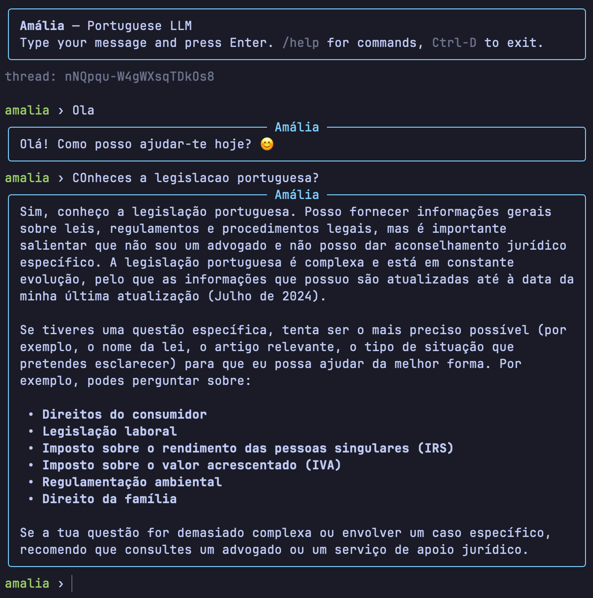

# Amália toolkit

Three small Python packages for talking to **Amália**, the Portuguese LLM (`amalia-llm/amalia-v1.0`) exposed via the IAEdu agent API.



| Package                                              | What it is                                                              |
| ---------------------------------------------------- | ----------------------------------------------------------------------- |
| [`amalia-sdk`](./amalia-sdk)                         | Synchronous client library (`AmaliaClient`)                             |
| [`amalia-cli`](./amalia-cli)                         | One-shot CLI: `amalia "prompt"` or pipe-in                              |
| [`amalia-chat`](./amalia-chat)                       | Interactive REPL with live Markdown rendering                           |
| [`skills/amalia-pt-validate`](./skills/amalia-pt-validate) | Drop-in **Claude Code skill** — lets the agent fact-check pt-PT answers via Amália |

The two apps share all transport, auth, and streaming logic via the SDK — no copy-paste. The skill is independent (pure-stdlib script) so it works without installing the SDK.

## Requirements

- Python ≥ 3.10
- An Amália account with an API key, agent id, and channel id (request from [iaedu.pt](https://iaedu.pt/pt))

## Install

```bash
git clone https://github.com/alfmatos/amalia.git
cd amalia

# Create a virtualenv (any 3.10+ works)
python3 -m venv .venv
source .venv/bin/activate

# Order matters — apps depend on the SDK
pip install -e ./amalia-sdk
pip install -e ./amalia-cli
pip install -e ./amalia-chat
```

## Configure

Two ways. Pick one.

**Environment variables:**

```bash
export AMALIA_API_KEY=sk-usr-...
export AMALIA_AGENT_ID=<your-agent-id>
export AMALIA_CHANNEL_ID=<your-channel-id>
# optional, only override if you're on a different deployment:
# export AMALIA_BASE_URL=https://api.iaedu.pt/agent-chat
```

**`creds.txt` file** (use the format your account ships with):

```
Endpoint: https://api.iaedu.pt/agent-chat//api/v1/agent/<your-agent-id>/stream
API Key: sk-usr-...
ChannelID: <your-channel-id>
```

Place it in the current directory or at `~/.amalia/creds.txt`. Env vars take precedence; the file is the fallback. **Never commit it** — `creds.txt` is in `.gitignore` already.

## Use

### `amalia` — one-shot CLI

```bash
amalia "Qual a capital de Portugal?"             # streams to stdout
echo "Resume isto: ..." | amalia --stdin         # read prompt from stdin
amalia -f question.txt                           # read prompt from a file
amalia --no-stream "Diz olá."                    # buffer, print at end
amalia --thread my-session "Como te chamas?"     # reuse a thread for memory
amalia --thread my-session "Repete o teu nome."
amalia --image cat.jpg "O que vês nesta foto?"   # attach an image
amalia --json "olá"                              # raw NDJSON events (debug)
```

Exit codes: `0` ok, `1` API/config error, `2` bad args.

### `amalia-chat` — interactive REPL

```bash
amalia-chat
```

Streams replies live, then re-renders them as Markdown so code blocks, lists, etc. look right. One thread per session means Amália remembers previous turns.

| Command          | What it does                                      |
| ---------------- | ------------------------------------------------- |
| `/new`           | Start a fresh thread (clears server-side memory)  |
| `/thread [id]`   | Show current thread id, or switch to a given id   |
| `/image <path>`  | Attach an image to the next message               |
| `/save <file>`   | Dump transcript to a Markdown file                |
| `/help`          | Show command help                                 |
| `/exit`          | Quit (Ctrl-D works too)                           |

Input history persists at `~/.amalia/history`.

### `amalia-sdk` — use it from Python

```python
from amalia_sdk import AmaliaClient, load_config

client = AmaliaClient(load_config())
thread = client.new_thread_id()

print(client.complete("Olá, quem és?", thread_id=thread))

for ev in client.stream("Conta-me uma piada curta.", thread_id=thread):
    if ev.type == "token":
        print(ev.content, end="", flush=True)
print()
```

Errors: `AmaliaAuthError` (401/403), `AmaliaHTTPError` (other non-2xx, exposes `.status_code` and `.body`), `AmaliaError` (base class — also raised on missing config or network failures).

### Claude Code skill — let the agent fact-check itself

Drop the bundled skill into Claude Code so it autonomously consults Amália whenever you ask a Portugal-specific question (law, taxes, public services, education, pt-PT terminology, etc.):

```bash
mkdir -p ~/.claude/skills
cp -r skills/amalia-pt-validate ~/.claude/skills/

# Verify
python3 ~/.claude/skills/amalia-pt-validate/scripts/ask_amalia.py \
    "Qual o IVA padrão em Portugal continental? Responde só com a percentagem."
# → 23%
```

The skill ships with its own credential lookup (env vars or `~/.amalia/creds.txt`) and uses pure Python stdlib — no `pip install` needed. See [`skills/amalia-pt-validate/README.md`](./skills/amalia-pt-validate/README.md) for the full install (project-level / user-level / Codex equivalents) and what triggers it.

## API notes

Amália has no public API documentation as of writing — these notes were reverse-engineered from the example request and a live test call.

- `POST https://api.iaedu.pt/agent-chat//api/v1/agent/{agent_id}/stream` (the double slash is intentional; that's what the example uses).
- Auth: `x-api-key: <key>` header.
- Body: `multipart/form-data` with required fields `channel_id`, `thread_id`, `user_info` (a JSON string, can be `{}`), `message`. Optional: `user_id`, `user_context`, `image` (file part).
- Response: streaming **NDJSON**, one event per line:
  - `{"type": "start",   "content": "Processing"}` — once, at the top
  - `{"type": "token",   "content": "<chunk>"}`     — many; concatenate for the reply
  - `{"type": "message", "content": {…full message with `model_name`, `finish_reason`, etc.}}`
  - `{"type": "done",    "content": "<run_id>", "messageId": "…"}`
- Conversation memory is per-`thread_id`, server-side. Reuse the same id to continue a chat.

## License

MIT.
